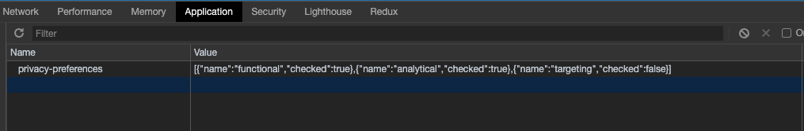
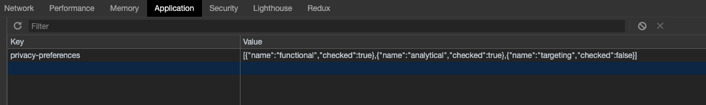
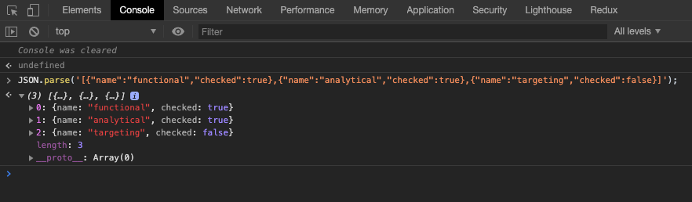
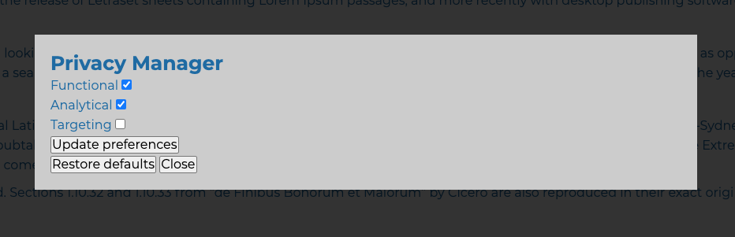

# Privacy Manager

Privacy manager is a plugin that allows to control **[cookies](https://en.wikipedia.org/wiki/HTTP_cookie)** or **[web storage](https://en.wikipedia.org/wiki/Web_storage)** data on client browser to ensure functionality of the site or enhance user experience.

## Cookie vs web storage?

Privacy Manager plugin allows us to choose which option to use. Cookie or web storage. This is due to their differences. Suh as those listed below:

### Cookie

- Cookie information is sent to server via headers
- Cookie with _HttpOnly_ flag are not available in Javascript, thus is immune to XSS attackes (CSRF still applies)
- Cookie can have expiry.
- All cookies are stored in single string

### Web storage ( local storage )

- Accessible from javascript always.
- Removal has to happen manually ( no expiry )
- Open to XSS attacks
- Larger capacity ( around 5mb )

Discussion regarding differences worth reading **[here](https://stackoverflow.com/questions/3220660/local-storage-vs-cookies)**.

## Approach

Plugin allows to store bulk information about user choices in JSON string in web storage or, if chosen, as cookie. JSON format remains the same.

Stored cookie:



Saved Web storage:



Parsed JSON:



Keeping them the same in terms of formatting is intentional and allows quick toggle of storage used.

Both - **key** and **name** can be replaced in props object to suit your needs.

## Setup

Plugin relies on HTML and JS working together. Particular HTML form and Javascript object with properties to run instance of the plugin.

Example HTML form:

```html
<section class="privacy-manager">
  <div class="pm-wrap">
    <h2 class="pm-heading">Privacy Manager</h2>

    <form class="pm-form" id="privacy-manager">
      <!-- Mandatory Functional cookies -->
      <div>
        <label for="functional">Functional</label>
        <input type="checkbox" name="functional" checked />
      </div>

      <!-- Mandatory Analytical cookies -->
      <div>
        <label for="analytical">Analytical</label>
        <input type="checkbox" name="analytical" checked />
      </div>

      <!-- Targeting cookies -->
      <div>
        <label for="targeting">Targeting</label>
        <input type="checkbox" name="targeting" />
      </div>

      <input type="submit" value="Update preferences" />
    </form>
  </div>
</section>
```

Each input field has a name which represents given item or item set (The way you control it is entirely up to you).

Instance using options/form above would be initialized as follows:

```js
const privacyManager = new PrivacyManager({
  form: document.getElementById('privacy-manager'),
  items: [
    {
      name: 'functional',
      checked: true,
    },
    {
      name: 'analytical',
      checked: true,
    },
    {
      name: 'targeting',
      checked: false,
    },
  ],
});
```

Each item or item group is one element in **items** array. It will always contain `name` and `checked` keys. Name is a link between JS and HTML and boolean of `checked` is default value if restore defaults functionality is implemented.

HTML:

```html
<div>
  <label for="analytical">Analytical</label>
  <input type="checkbox" name="analytical" checked />
</div>
```

JS:

```js
{
  name: 'analytical',
  checked: true,
}
```

Above means that each item or item group should be added in both places.

## Methods

Plugin provides '**_on_**' methods as well as item/item group specific methods.

### "on"

The "on" key allows to hook into certain action within plugin. This can be useful if you need to reload window on update or notify user about changes.

Each method gets the same payload.

Payload includes:

- **form** : Form used for options ( DOM object )
- **id** : key/name used for cookie/web storage ( String )
- **data** : JSON parsed data with latest choices ( Array )

```js
{
 data: [
         {name: "functional", checked: true}
         {name: "analytical", checked: true}
         {name: "targeting", checked: false}
       ],
 form: form#privacy-manager.pm-form
 id: "privacy-preferences"
}
```

Sample in props object:

```js
  on: {
    init: (payload) => console.log(payload), // plugin initialization
    update: (payload) => console.log(payload), // cookie/web storage updated
    restore: (payload) => console.log(payload) // restore initiated
  },
```

Restore can be executed using restoreDefaults method available in plugin.

Sample:

```js
const restore = document.querySelector('.restore');
restore.addEventListener('click', privacyManager.restoreDefaults, false);
```

### Item specific methods

Items, beside name and default value, accept methods to be executed in different scenarios.

Each item in **items** can have upto 3 hook methods :

- **onApprove** - executed if checkbox is checked.
- **onDeny** - executed if checkbox is un checked
- **onAction** - executed regardless of checkbox state.

Here we have a choice - Either to allow plugin transfer items to relevant method ( approve or deny ) or contain logic in your own method by executing **onAction**

Each method receives payload containing **name** and **checked** status:

```js
{
  name: 'targeting',
  checked: false
}
```

Full sample:

```js
    items: [
      {
        name: 'functional',
        onAction: (item) => console.log('Action', item),
        checked: true, // default value
      },
      {
        name: 'analytical',
        onApprove: (item) => console.log('Approve', item),
        onDeny: (item) => console.log('Deny', item),
        checked: true, // default value
      },
      {
        name: 'targeting',
        onApprove: (item) => console.log('Approve', item),
        onDeny: (item) => console.log('Deny', item),
        checked: false, // default value
      },
    ],
```

## Configuration object

Defaults:

```js
{
  expDays: 'Thu, 01 Jan 1970 00:00:00 GMT', // used to set expiry for cookies
  saveAsCookie: true, // if true - cookies used instead of local storage
  cookieExp: 365, // days till expiry ( cookie only )
  savePreferences: true, // save set preferences in local storage/cookie or not?
  key: 'privacy-preferences', // key for local storage
  form: null, // DOM object
  on: {
    init: null,
    update: null,
    restore: null,
  },
  items: [], // {name = str, onApprove = func, onDeny = func, onAction = func checked=bool //default state}
};
```

Single item (object inside items array):

```js
{
  name: 'targeting', // same as form input(checkbox) name
  onApprove: (item) => console.log('Approve', item), // if checked
  onDeny: (item) => console.log('Deny', item), // if denied
  onAction: (item) => console.log('Action', item), // regardless of approved/denied
  checked: false, // default value of checkbox (used on restore defaults)
}
```

Now example with usage:

```js
const privacyManager = new PrivacyManager({
  saveAsCookie: false,
  form: document.getElementById('privacy-manager'),
  on: {
    init: (payload) => console.log(payload),
    update: (payload) => console.log(payload),
    restore: (payload) => console.log(payload),
  },
  items: [
    {
      name: 'functional',
      onAction: (item) => console.log('Action', item),
      checked: true,
    },
    {
      name: 'analytical',
      onApprove: (item) => console.log('Approve', item),
      onDeny: (item) => console.log('Deny', item),
      checked: true,
    },
    {
      name: 'targeting',
      onApprove: (item) => console.log('Approve', item),
      onDeny: (item) => console.log('Deny', item),
      checked: false,
    },
  ],
});
```

Basic form:



## Server side Extra

Cookies are available on server side. Retrieval depends on language used. This example used PHP to retrieve and respond to cookie value.

Helper function accepts two arguments. **name** of the preference item and **cookie** name ( default = 'privacy-preferences' );

running function without arguments will return all available choices;

This is useful if you need to perform action depending on user preference. For example :

default setting for widget X is set to false ( checked : false ). This means that on page load widget X is not rendered on the page. After modifying preferences user has checked widget X to be run on the site. After next refresh ( or programmatic refresh ), upon page load server sees this cookie as checked and loads widget X

Example in code :

```php

<?php
  $acceptAnalytics = getPrivacyPref('widget-x') ?: false;
?>

<?php if($acceptAnalytics) : ?>

  <div class="widget-x">
    // Loading widget X
  </div>

<?php endif; ?>

```

Full function

```php
/**
 *  Function to aid cookie setting retrieval in PHP
 *  Intended to be used along with PrivacyManager JS plugin
 *  var_dump(getPrivacyPref('functional'));
 *  Two named arguments.
 *  $name - name of the cookie or cookiee group in question. Matches input field name in Privacy Manager HTML
 *  $cookie - cookie name in browser. Defaults : 'privacy-preferences'. This should match with the one set in Privacy Manger.
 *
 *  Returns '' (empty string) if no key/preference is found within cookie or boolean. true - (cookie) approved, false - (cookie) denied.
 *
 *  Calling function without arguments will return list of all preferences.
 *
 *  getPrivacyPref(); // returns all available preferences set within cookie
 *  getPrivacyPref('functional'); // returns boolean if checked or not or empty string if cookie does not contain such value.
 *
 * Example:
 * $acceptAnalytics = getPrivacyPref('analytical') ?: false;
 * if($acceptAnalytics) {
 *  // Execute whatever you need.
 * }
 */

function getPrivacyPref($name = '', $cookie = 'privacy-preferences'){

  $noName = trim($name) === '';

  if(!isset($_COOKIE[$cookie])) return null;

  $jsonString = urldecode($_COOKIE[$cookie]);
  $jsonString = str_replace("\\", "", $jsonString);
  $data = JSON_decode($jsonString,true);

  $result = '';
  $all = [];

  foreach ($data as &$item) {
    if(trim($item['name']) === trim($name)) $result = $item['checked'];
    $curr = [
      'name' => $item['name'],
      'checked' => $item['checked']
    ];

    array_push($all,$curr);
  }

  unset($item);

  return $noName ? $all : $result;

}
```
